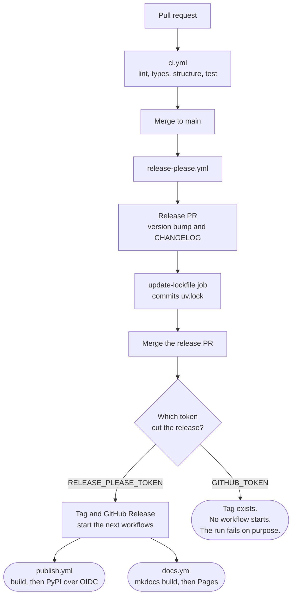

# Cut a release

release-please cuts every release from the commit history. You never edit a
version by hand. This page shows what runs, in what order, and the one
condition that stops the second half.

## The flow



<details markdown="1">
<summary>The same flow in text</summary>

1. A pull request runs `ci.yml`. It holds four jobs: lint, types, structure
   and test.
2. Merging to `main` starts `release-please.yml`.
3. release-please opens a release PR. The PR carries the version bump and the
   CHANGELOG entry.
4. The `update-lockfile` job commits `uv.lock` onto that same PR.
5. Merging the release PR makes release-please cut a tag and a GitHub Release.
6. Cut with `RELEASE_PLEASE_TOKEN`, the tag and the release start two
   workflows at once. `publish.yml` uploads to PyPI over OIDC. `docs.yml`
   deploys the site to GitHub Pages.
7. Cut with `GITHUB_TOKEN`, the tag still exists. GitHub starts no workflow
   from it, so neither PyPI nor Pages updates.
8. `release-please.yml` detects that case and fails its own run.

</details>

## Why the token decides

GitHub does not start a workflow from an event that `GITHUB_TOKEN` created.
The rule stops a workflow triggering itself forever. Here it means a release
cut with the default token produces a tag that reaches neither PyPI nor Pages.

The release looks green. Nothing ships. `release-please.yml` therefore fails
the run at that moment rather than later.

```yaml
- name: Fail a release cut without the PAT
  if: steps.release.outputs.release_created == 'true' && env.HAS_PAT != 'true'
```

Set `RELEASE_PLEASE_TOKEN` to a personal access token with `contents: write`
and `pull-requests: write`. Without it, push the tag by hand after the run
fails.

## Why the lockfile job exists

release-please bumps the version in `pyproject.toml`. It does not touch
`uv.lock`, which records the same version. The release PR would then fail its
own `uv lock --check`, and the failure would read as a lockfile problem rather
than a release-tooling one.

## What you control

Only the commit subjects. `feat` bumps the minor version. `fix` bumps the
patch. `release-please-config.json` maps each type to a CHANGELOG section.

Tags are immutable. A bug in a published tag gets a new patch tag and a note.
