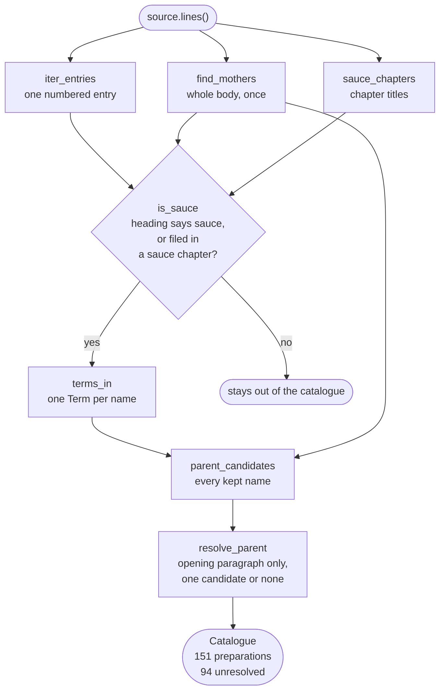

# Data model

Every entity is a frozen dataclass. Nothing in the domain performs IO.

## How one source becomes a catalogue

`saucier.services.extraction` makes every entity below in two passes. The
first pass reads the mothers, the sauce chapters, and every kept entry. The
second pass resolves each parent against every name the first pass produced.
The candidates are therefore read out of the source, not supplied to it.



<details markdown="1">
<summary>The same pipeline in text</summary>

1. The source reader yields the body as lines.
2. `find_mothers` scans the whole body once. It returns the concepts the
   source itself calls basic sauces.
3. `iter_entries` walks the same lines. It yields one numbered entry at a
   time. A heading that wraps onto a second line is read whole, so the two
   witnesses do not disagree about a title the typesetter broke.
4. `sauce_chapters` reads the chapter titles. It returns the line spans of
   the chapters the source titles as sauce chapters.
5. `is_sauce` keeps a heading that says "sauce" before any "with". It
   otherwise keeps an entry only when the source filed it in a sauce
   chapter. The chapter decides, and the heading does not overrule it.
6. A rejected entry stays out of the catalogue.
7. `terms_in` splits a kept heading into one `Term` per alternative name, each
   tagged with its language.
8. `parent_candidates` collects every name a stated parent may use. The names
   are every term of every kept preparation, plus the mothers.
9. `resolve_parent` reads the opening paragraph only. It sets the parent to
   the single candidate that paragraph states. It sets `None` when the
   paragraph states none, and also when it states more than one.
10. A cycle of stated parents is cleared, so no preparation is its own
    ancestor.
11. The result is a `Catalogue` of 151 preparations. 57 resolve to a stated parent
    and 94 are unresolved.

</details>

## `Term`

A culinary term as one source writes it, in one language.

| Field | Type | Notes |
| --- | --- | --- |
| `surface` | `str` | Exactly as written. Never translated. |
| `language` | `Language` | ISO 639-1, inferred from the surface form. |
| `concept` | `ConceptId` | Derived from `surface`, not stored beside it. |

Terms are never translated. `mole` is not "sauce". `nixtamal` is not "corn".
Translating a term destroys the distinction the term exists to carry, so
surface forms are preserved and tagged instead.

## `ConceptId`

A folded identifier: diacritics stripped, lowercased, punctuation collapsed
to hyphens. `Velouté` and `VELOUTE` reach `veloute`.

Folding resolves **orthographic** variation only. It does not resolve semantic
equivalence across languages. Deciding that `salsa española` and `espagnole`
denote one concept requires evidence, not string manipulation.

## `Edition`

What a title page states about which printing a text is. Four fields, kept
apart because one string cannot carry four facts.

| Field | Type | Notes |
| --- | --- | --- |
| `statement` | `str \| None` | The edition line, verbatim. `None` when none is stated. |
| `stated_year` | `int \| None` | Year of that statement. |
| `impression` | `str \| None` | The last printing the history records. |
| `copyright_year` | `int \| None` | Year on the copyright line. |
| `year` | `int` | Derived: the stated year, falling back to the copyright year. |

An edition naming neither year raises `EditionUnstated`. A text with no
stated identity is reported, never named from its path.

## `Witness`

One text of one edition, and how this project came by it: the `work`, the
`origin` it was fetched from, its `fidelity`, and its `edition`. The
`source_id` is the work and the edition year, joined.

| Witness | Edition | Fidelity |
| --- | --- | --- |
| `escoffier-1909` | New and Revised Edition, January 1909 | `transcription` |
| `escoffier-1907` | no edition stated, copyright 1907 | `ocr` |

## `Fidelity`

How a witness was obtained. `transcription` is proofread by hand. `ocr` is
machine-read from a scan. It is stated where the URL is recorded, never
inferred from the characters. See
[ADR-0010](../adr/0010-fidelity-is-a-property-of-the-record.md).

## `SourceRef`

Where a preparation was found. It carries `source_id`, the source's own
`entry` number, the `line` it begins on, and the `fidelity` of the text the
claim came through. Every extracted claim carries one, so any output can be
checked against the text by hand.

`line` is the line number in the file on disk. The reader strips the Project
Gutenberg licence header, then adds the stripped line count back. The number
needs no adjustment:

```console
$ sed -n '2138p' corpus/escoffier-1909.txt
64—BÉARNAISE TOMATÉE SAUCE OR CHORON SAUCE
```

Within one catalogue the `line` identifies a preparation, because a scan can
read two headings as one entry number. The 1907 witness carries two
preparations at entry 138 and two at 63.

`entry` and `line` are keyword-only, and both must be 1 or greater. Two
integers side by side invite a transposition, and a transposed citation
points a reader at the wrong text while still type-checking.

A `source_id` names an edition, not a work, because two editions of one book
number their entries differently. It is read from the document rather than
taken from the path. See
[ADR-0009](../adr/0009-the-source-states-its-own-identity.md).

## `Preparation`

One numbered entry. Carries its `title`, its `terms`, its unparsed `body`,
its `ref`, and its `parent`.

`parent` may name a mother or any catalogued preparation. When the opening
paragraph states a mother, the mother concept is recorded. Otherwise the
parent preparation's own concept is. A mother may carry a parent of its own,
so Espagnole records brown roux. Chains never cycle, because the extractor
clears every derivation on a cycle.

`parent` is `None` when the source states no base. That is "unresolved", not
"has no parent". The distinction matters, and the parser never guesses across
it. `parent` has no default, so every construction site states the absence
rather than inheriting it.

An entry whose opening paragraph states two candidates is also unresolved.
The source named both and chose neither, so the parser records no choice.

## `Catalogue`

Everything read from one witness, plus the `mothers` the source names for
itself. The `witness` travels with the catalogue, so a stored file states
which edition it holds. A catalogue refuses a record whose reference names
another source or another fidelity.

| Member | Returns |
| --- | --- |
| `by_concept()` | Index by every name a preparation answers to |
| `matches(concept)` | Every preparation a name could mean, best first |
| `find(concept)` | The best match, or `None` |
| `children_of(concept)` | Derivations, in source order |
| `resolved` | Count of preparations with a parent |
| `unresolved` | Count of preparations without one. The published score |

`matches` takes an exact hit outright. Otherwise the name has to appear as a
whole run of words, so `bordelaise` reaches `SAUCE BORDELAISE` and never
`bordelaise-butter`. A mother binds to the first preparation the source
presents among its hits, because the source states a base before its
derivatives. Any other concept prefers the least qualified name, then source
order.

## `Language`

[ISO 639-1](https://en.wikipedia.org/wiki/List_of_ISO_639_language_codes)
codes for languages actually present in tracked sources. A member is added
when a source in that language is added, not in anticipation. The tracked
corpus is English and French, so those are the two members.

## `Procedure`

The operations one body states, in the order it states them. A procedure
is recorded beside a preparation and never in place of its parent. This
release records one preparation, `MORNAY SAUCE`, once per witness, by
hand. See [ADR-0017](../adr/0017-a-procedure-quotes-its-witness.md).

Every element quotes its witness. An operation carries the clause it was
read from as its `wording`, and each element inside it carries its own.
The entity refuses an element whose words are not inside its operation's.
`unstated(body)` names every operation the body does not carry in that
order, so a procedure recorded by hand is checked rather than trusted.

| Entity | Fields | Notes |
| --- | --- | --- |
| `Operation` | `wording`, `verb`, `inputs`, `instrument`, `criterion`, `duration`, `constraints` | The verb and the instrument are terms. No field has a default. |
| `Input` | `wording`, `term`, `quantity` | The preparation in progress is not an input. |
| `Parameter` | `wording`, `number`, `unit` | `number` is `None` when the words give none. |

`number` is a `Fraction`. `one-quarter pint` records `1/4` and `pint`, and
`a few minutes` records `minutes` and no number. `None` is unresolved in
the sense of ADR-0002, and no code fills it.

A procedure is not stored, and the interchange does not carry it.
`saucier show` fetches it through `RecordedProcedures`, checks it against
the body, and prints it. A preparation with none recorded prints
`(unrecorded)`, which says nothing about the source.

## Interchange

`saucier export` writes every entity above except the procedure as JSON
Lines. Each line is one record, and every record carries an envelope of
`schema`, `type`, and `id`.
The schema is `saucier/1`. A program with none of these classes reads one
line and knows what it holds and which catalogue it belongs to. See
[ADR-0016](../adr/0016-jsonl-is-the-interchange-not-a-store.md).

A catalogue record carries the `Witness` fields, the mothers, how many
preparations follow it, and `entries_read`. Its id is the catalogue's
source id. The count lets the reader refuse a stream that was cut at a
line boundary, which is otherwise complete JSON.

```json
{"schema":"saucier/1","type":"catalogue","id":"escoffier-1909","work":"escoffier","edition":{"statement":"New and Revised Edition, January 1909","stated_year":1909,"impression":"January 1920","copyright_year":1907},"origin":"Project Gutenberg 71395","fidelity":"transcription","mothers":["bechamel","espagnole","hollandaise","tomato","veloute"],"preparations":151,"entries_read":2963}
```

| Field | Holds |
| --- | --- |
| `schema` | `saucier/1` |
| `type` | `catalogue` |
| `id` | The source id. Recomputed from `work` and `edition` on the way back. |
| `work` | `Witness.work` |
| `edition` | The four `Edition` fields, `null` where the front matter states none |
| `origin` | `Witness.origin` |
| `fidelity` | `transcription` or `ocr` |
| `mothers` | Concept ids, sorted |
| `preparations` | How many preparation records name this catalogue |
| `entries_read` | `Catalogue.entries_read`, or `null` when no count was recorded |

A preparation record names its catalogue and carries one `Preparation`. Its
id is the catalogue id and the heading line, joined. The entry number is not
identity, because a scan repeats numbers.

```json
{"schema":"saucier/1","type":"preparation","id":"escoffier-1909:line:38713","catalogue":"escoffier-1909","title":"STRAWBERRY SAUCE","terms":[{"surface":"STRAWBERRY SAUCE","language":"en","concept":"strawberry-sauce"}],"concept":"strawberry-sauce","parent":null,"ref":{"entry":2417,"line":38713,"fidelity":"transcription"},"body":"Proceed as for No. 2416."}
```

| Field | Holds |
| --- | --- |
| `schema` | `saucier/1` |
| `type` | `preparation` |
| `id` | The catalogue id and the line. Recomputed on the way back. |
| `catalogue` | The id of the catalogue record |
| `title` | `Preparation.title`, verbatim |
| `terms` | One object per `Term`: `surface`, `language`, and its `concept` |
| `concept` | `Preparation.concept`. Recomputed on the way back. |
| `parent` | A concept id, or `null` for unresolved |
| `ref` | `entry`, `line`, and `fidelity` |
| `body` | `Preparation.body`, verbatim |

`null` never means the preparation has no parent. It means the source stated
none, or stated more than one. The reader rejects a blank parent, because a
blank was never a concept id.

Every derived field is recomputed by the reader and compared. A record whose
`concept` is not folded from its terms is rejected at its line number. So is
a record whose `id` does not address its line.

A catalogue id names an edition, because `Witness.source_id` is the work and
the edition year. It is not a witness id. Two texts of one edition would
share it. So a stream carries one catalogue per source id, and the reader
rejects a second as a duplicate. A preparation id is an address inside one
catalogue. It does not say that two catalogues hold one sauce.
