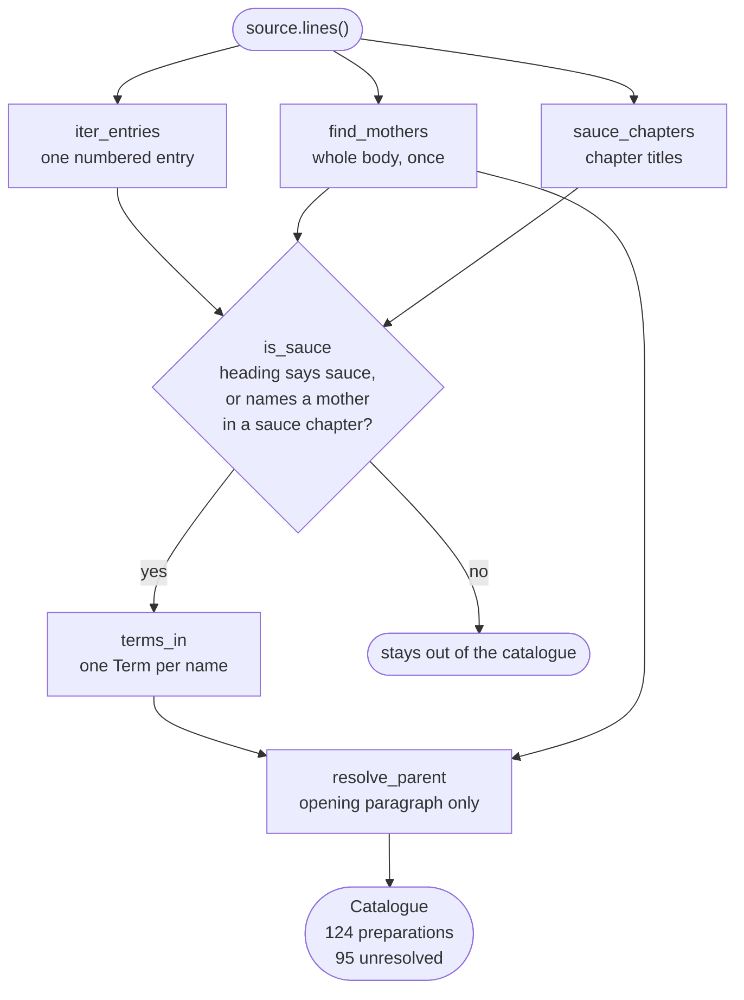

# Data model

Every entity is a frozen dataclass. Nothing in the domain performs IO.

## How one source becomes a catalogue

`saucier.services.extraction` makes every entity below in one pass.
`find_mothers` and `sauce_chapters` run before the filter, and the parent
rule reads the mothers too. The five mothers and the three sauce chapters are
therefore read out of the source, not supplied to it.



<details markdown="1">
<summary>The same pipeline in text</summary>

1. The source reader yields the body as lines.
2. `find_mothers` scans the whole body once. It returns the concepts the
   source itself calls basic sauces.
3. `iter_entries` walks the same lines. It yields one numbered entry at a
   time.
4. `sauce_chapters` reads the chapter titles. It returns the line spans of
   the chapters the source titles as sauce chapters.
5. `is_sauce` keeps a heading that says "sauce" before any "with". It
   otherwise keeps a heading only when the heading names a mother and the
   entry sits inside a sauce chapter.
6. A rejected entry stays out of the catalogue.
7. `terms_in` splits a kept heading into one `Term` per alternative name, each
   tagged with its language.
8. `resolve_parent` reads the opening paragraph only. It sets the parent to
   the single mother that paragraph names. It sets `None` when the paragraph
   names none, and also when it names more than one.
9. The result is a `Catalogue` of 124 preparations. 29 resolve to a mother and
   95 are unresolved.

</details>

## `Term`

A culinary term as one source writes it, in one language.

| Field | Type | Notes |
| --- | --- | --- |
| `surface` | `str` | Exactly as written. Never translated. |
| `language` | `Language` | ISO 639-1, inferred from the surface form. |
| `concept` | `ConceptId` | Derived from `surface`, not stored beside it. |

Terms are never translated. `mole` is not "sauce". `nixtamal` is not "corn".
Translating a term destroys the distinction the term exists to carry, so
surface forms are preserved and tagged instead.

## `ConceptId`

A folded identifier: diacritics stripped, lowercased, punctuation collapsed
to hyphens. `Velouté` and `VELOUTE` reach `veloute`.

Folding resolves **orthographic** variation only. It does not resolve semantic
equivalence across languages. Deciding that `salsa española` and `espagnole`
denote one concept requires evidence, not string manipulation.

## `SourceRef`

Where a preparation was found: `source_id`, the source's own `entry` number,
and the `line` it begins on. Every extracted claim carries one, so any output
can be checked against the text by hand.

`line` is the line number in the file on disk. The reader strips the Project
Gutenberg licence header, then adds the stripped line count back. The number
needs no adjustment:

```console
$ sed -n '2138p' corpus/escoffier-1907.txt
64—BÉARNAISE TOMATÉE SAUCE OR CHORON SAUCE
```

`entry` and `line` are keyword-only, and both must be 1 or greater. Two
integers side by side invite a transposition, and a transposed citation
points a reader at the wrong text while still type-checking.

`escoffier-1907` is [*A Guide to Modern Cookery*](https://www.gutenberg.org/ebooks/71395)
by A. Escoffier. The copy under `corpus/` is Project Gutenberg ebook 71395,
released on 2023-08-12. A `source_id` names an edition, not a work, because
two editions of one book number their entries differently.

## `Preparation`

One numbered entry. Carries its `title`, its `terms`, its unparsed `body`,
its `ref`, and its `parent`.

`parent` is `None` when the source states no mother. That is "unresolved", not
"has no mother". The distinction matters, and the parser never guesses across
it. `parent` has no default, so every construction site states the absence
rather than inheriting it.

An entry whose opening paragraph names two mothers is also unresolved. The
source named both and chose neither, so the parser records no choice.

## `Catalogue`

Everything read from one source, plus the `mothers` the source names for
itself.

| Member | Returns |
| --- | --- |
| `by_concept()` | Index by every name a preparation answers to |
| `matches(concept)` | Every preparation a name could mean, best first |
| `find(concept)` | The best match, or `None` |
| `children_of(concept)` | Derivations, in source order |
| `resolved` | Count of preparations with a parent |
| `unresolved` | Count of preparations without one. The published score |

`matches` takes an exact hit outright. Otherwise the name has to appear as a
whole run of words, so `bordelaise` reaches `SAUCE BORDELAISE` and never
`bordelaise-butter`. Candidates are ordered by how little else their name
carries, then by source order. Both signals come from the source: the least
qualified name is the base, and Escoffier states a base before its
derivatives.

## `Language`

[ISO 639-1](https://en.wikipedia.org/wiki/List_of_ISO_639_language_codes)
codes for languages actually present in tracked sources. A member is added
when a source in that language is added, not in anticipation. The tracked
corpus is English and French, so those are the two members.
