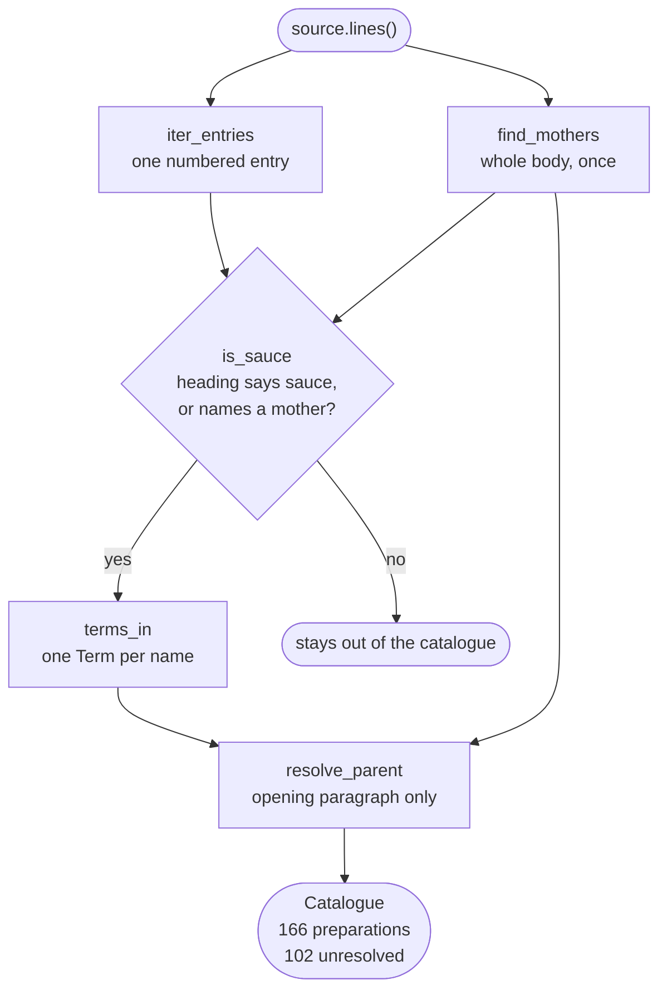

# Data model

Every entity is a frozen dataclass. Nothing in the domain performs IO.

## How one source becomes a catalogue

`saucier.services.extraction` makes every entity below in one pass.
`find_mothers` runs before the filter and before the parent rule, and both
read its result. The five mothers are therefore read out of the source, not
supplied to it.



<details markdown="1">
<summary>The same pipeline in text</summary>

1. The source reader yields the body as lines.
2. `find_mothers` scans the whole body once. It returns the concepts the
   source itself calls basic sauces.
3. `iter_entries` walks the same lines. It yields one numbered entry at a
   time.
4. `is_sauce` tests each heading against the mothers. It keeps a heading that
   says sauce or names a mother. It rejects a heading shaped like a dish.
5. A rejected entry stays out of the catalogue.
6. `terms_in` splits a kept heading into one `Term` per alternative name, each
   tagged with its language.
7. `resolve_parent` reads the opening paragraph only. It sets the parent to a
   mother that paragraph names. It sets `None` when the paragraph names none.
8. The result is a `Catalogue` of 166 preparations. 64 resolve to a mother and
   102 are unresolved.

</details>

## `Term`

A culinary term as one source writes it, in one language.

| Field | Type | Notes |
| --- | --- | --- |
| `surface` | `str` | Exactly as written. Never translated. |
| `language` | `Language` | ISO 639-1, inferred from the surface form. |
| `concept` | `ConceptId` | Language-independent identifier. |

Terms are never translated. `mole` is not "sauce". `nixtamal` is not "corn".
Translating a term destroys the distinction the term exists to carry, so
surface forms are preserved and tagged instead.

## `ConceptId`

A folded identifier: diacritics stripped, lowercased, punctuation collapsed
to hyphens. `Velouté` and `VELOUTE` reach `veloute`.

Folding resolves **orthographic** variation only. It does not resolve semantic
equivalence across languages. Deciding that `salsa española` and `espagnole`
denote one concept requires evidence, not string manipulation.

## `SourceRef`

Where a preparation was found: `source_id`, the source's own `entry` number,
and the `line` it begins on. Every extracted claim carries one, so any output
can be checked against the text by hand.

`line` counts within the source body. The reader removes the Project Gutenberg
licence header and footer before it counts. The number is therefore not the
line number in the file on disk. For `escoffier-1907` that header is 24 lines,
so body line 2114 is file line 2138.

```console
$ sed -n '2138p' corpus/escoffier-1907.txt
64—BÉARNAISE TOMATÉE SAUCE OR CHORON SAUCE
```

`escoffier-1907` is [*A Guide to Modern Cookery*](https://www.gutenberg.org/ebooks/71395)
by A. Escoffier. The copy under `corpus/` is Project Gutenberg ebook 71395,
released on 2023-08-12. A `source_id` names an edition, not a work, because
two editions of one book number their entries differently.

## `Preparation`

One numbered entry. Carries its `title`, its `terms`, its unparsed `body`,
its `ref`, and its `parent`.

`parent` is `None` when the source states no mother. That is "unresolved", not
"has no mother" — the distinction matters, and the parser never guesses across
it.

## `Catalogue`

Everything read from one source, plus the `mothers` the source names for
itself.

| Member | Returns |
| --- | --- |
| `by_concept()` | Index by every name a preparation answers to |
| `find(concept)` | Lookup with a name-ending fallback |
| `children_of(concept)` | Derivations, in source order |
| `resolved` | Count of preparations with a parent |

## `Language`

[ISO 639-1](https://en.wikipedia.org/wiki/List_of_ISO_639_language_codes)
codes for languages actually present in tracked sources. A member is added
when a source in that language is added, not in anticipation.
